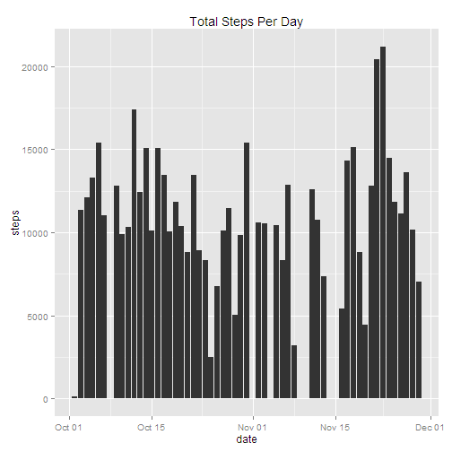
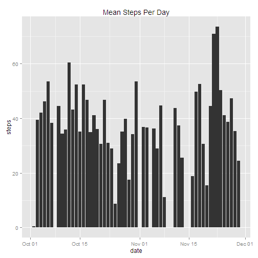
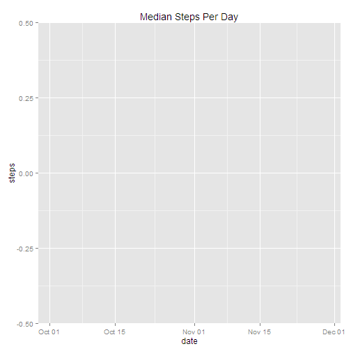
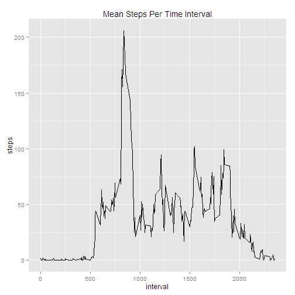
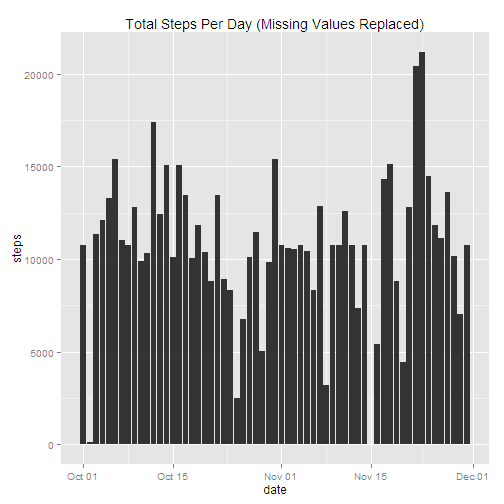
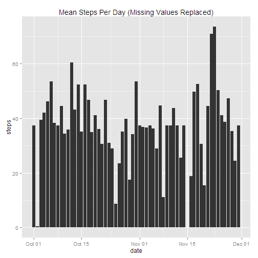
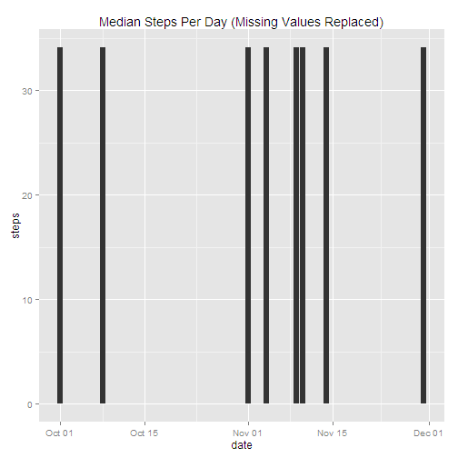
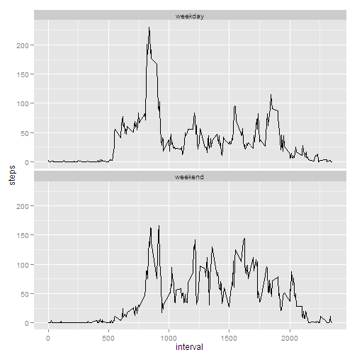

# Reproducible Research: Peer Assessment 1
This assignment was completed by John Taylor for the Reproducible Research class.

## Loading and preprocessing the data
The activity monitoring data was taken from Dr. Peng's GitHub repository, [here](https://github.com/rdpeng/RepData_PeerAssessment1).

```r
## Read the activity data, coverting the date column to the Date class.
columnClasses <- c("integer", "Date", "integer")
amData <- read.csv("./activity.csv", colClasses = columnClasses)
```

## What is total, mean, and median number of steps taken per day?
The graphs below show the answers, but due to the large number of missing data elements, the results are often misleading. There are also a very large number of 0 entries, even for times of the day when subject would likely have taken steps. Perhaps they were not wearing the device?  

```r
library(ggplot2)

## Calculate the total number of steps per day.
amDataTotalByDate <- aggregate(steps ~ date, data = amData, FUN=sum)
## Create a "histogram", in this case a bar plot, of steps by day.
qplot(date, steps, data = amDataTotalByDate, geom = "bar", stat = "identity", 
      main = "Total Steps Per Day")
```

 

```r
## Calculate the mean number of steps per day and plot.
amDataMeanByDate <- aggregate(steps ~ date, data = amData, FUN=mean)
qplot(date, steps, data = amDataMeanByDate, geom = "bar", stat = "identity", 
      main = "Mean Steps Per Day")
```

 

```r
## Calculate the median number of steps per day and plot.
amDataMedianByDate <- aggregate(steps ~ date, data = amData, FUN=median, na.rm = TRUE)
qplot(date, steps, data = amDataMedianByDate, geom = "bar", stat = "identity", 
      main = "Median Steps Per Day")
```

 
  
Note that the median graph appears to show no answer. In fact, the answer for every day is zero. This is an indicator of the large number of zero entries for many intervals.  
## What is the average daily activity pattern?

```r
amDataMeanByInterval <- aggregate(steps ~ interval, data = amData, FUN=mean)
qplot(interval, steps, data = amDataMeanByInterval, geom="path", stat = "identity", 
      main = "Mean Steps Per Time Interval")
```

 

```r
maxMeanByInterval <- 
    amDataMeanByInterval[amDataMeanByInterval$steps == max(amDataMeanByInterval$steps),
                         "interval"]
```
The interval with maximum mean number of steps is 835.   
## Imputing missing values
To provide a view of the data, if the missing values were filled in with representative ones, I have replaced all NAs in the data set with the average value for that interval taken across all days in the data set.

```r
## Determine the number of missing values in the data set.
numMissingValues <- nrow(amData[is.na(amData$steps),])
```
There are 2304 missing steps values in the data set. 
  
The following graphs repeat the total, mean, and median graphs shown above, but with 
the missing values in the data set replaced by averages.

```r
## Create a data set with no missing values.
amDataNoMV <- amData
## Replace the NAs in the data set with the mean number of steps for that interval.
## This is accomplished below by looping through the data set. While this technique 
## doesn't make use of cool R functions, it took MUCH less time to write than trying 
## to get a version of indexing and vector operations, or one of the apply functions to 
## work.

newStepsVector <- vector()
for (rowNum in 1:nrow(amDataNoMV)) {
    if (is.na(amDataNoMV[rowNum, "steps"])) {
        newStepsVector <- c(newStepsVector,  
            amDataMeanByInterval[amDataMeanByInterval$interval == amDataNoMV[rowNum, "interval"],
                                     "steps"])
    } else {  
        newStepsVector <- c(newStepsVector, amDataNoMV[rowNum, "steps"])
    } 
}
amDataNoMV$steps <- newStepsVector


## Re-do the first three graphs with the new data set.
amDataNoMVTotalByDate <- aggregate(steps ~ date, data = amDataNoMV, FUN=sum)
qplot(date, steps, data = amDataNoMVTotalByDate, geom = "bar", stat = "identity", 
      main = "Total Steps Per Day (Missing Values Replaced)")
```

 

```r
amDataNoMVMeanByDate <- aggregate(steps ~ date, data = amDataNoMV, FUN=mean)
qplot(date, steps, data = amDataNoMVMeanByDate, geom = "bar", stat = "identity", 
      main = "Mean Steps Per Day (Missing Values Replaced)")
```

 

```r
amDataNoMVMedianByDate <- aggregate(steps ~ date, data = amDataNoMV, FUN=median, na.rm = TRUE)
qplot(date, steps, data = amDataNoMVMedianByDate, geom = "bar", stat = "identity", 
      main = "Median Steps Per Day (Missing Values Replaced)")
```

 
  
Filling the NAs with average values makes only minor changes in the resulting graphs. 
There are so many zeros in the data that missing values only show a difference for entire 
days of missing data. The peak total and peak mean numbers remain largely unchanged.

## Are there differences in activity patterns between weekdays and weekends?

```r
## Create a function to determine whether the data is weekend or weekday 
## and return the appropriate value.
TypeOfDay <- 
    function(amDate) {
        if(weekdays(amDate) %in% c("Saturday", "Sunday")) {
            returnDay = "weekend"
        } else {
            returnDay = "weekday"  
        }
        returnDay
    }

## Using the TypeOfDay function above, add a new column to the data set 
## indicating what type day the date is. Create the new variable as a factor.
amDataNoMV$TypeOfDay <- as.factor(sapply(amDataNoMV$date, FUN = TypeOfDay))

## Find the mean of the number of steps by interval and type of day.
amDataNoMVMeanByInterval <- aggregate(steps ~ interval + TypeOfDay, data = amDataNoMV, FUN=mean)

## Plot the mean steps per interval using two graphs (facets), one each for weekend and weekday.
p <- qplot(interval, steps, data = amDataNoMVMeanByInterval, geom = "path", stat = "identity", 
          Main = "Steps Per Interval")
## To force the facet function to place the graphs one on top of the other use the facet_wrap 
## funciton after creating the qplot.
p + facet_wrap(~ TypeOfDay, nrow = 2, ncol = 1)
```

 
  
The data show a significant difference: weekdays show a majority of steps in the morning, while 
steps during the weekend are more spread out throughout the day.
